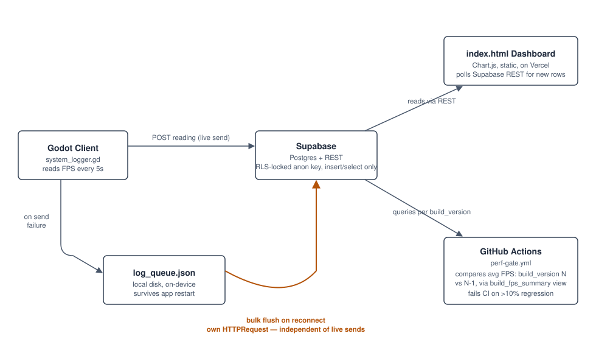

# DevInsight Dashboard

Live performance telemetry pipeline for my Godot game, **Ascent**. Every 5 seconds the running
game reports FPS and memory usage to a Postgres backend, which a live dashboard charts in real
time — and a CI gate fails the build if it regresses performance by more than 10% against the
baseline that commit declares.

**Pipeline:** Godot (`godot/system_logger.gd`) → `POST /api/ingest` (Vercel Function) → Supabase
(Postgres) → `index.html` dashboard (Chart.js) → GitHub Actions performance gate on every push.

10% FPS regression.">

The dashboard supports 5-minute through 24-hour query windows, build filtering and baseline
comparison, deploy/build markers, and a clickable performance-event timeline. Its headline
metrics emphasize tail behavior (P95 frame time and 1% low FPS) rather than relying only on an
average that can hide stutters. Build status is derived from explicit healthy, warning, and
regression thresholds.

## Notable engineering decisions

**Offline retry queue.** If the game can't reach Supabase (dropped connection, brief outage),
data points aren't silently lost — they queue locally on disk. On reconnect, the entire backlog
is sent as a single bulk insert rather than trickling out one row every 5 seconds, so a long
outage doesn't leave live gameplay data stuck behind a slow-draining queue.

Building this surfaced three real bugs worth mentioning:
- **A blocking design flaw**: the first version prioritized flushing the backlog over collecting
  new data, so as long as anything was queued, fresh telemetry stopped being gathered entirely.
  Fixed by giving the flush its own independent request instead of sharing one with live sends.
- **A JSON type-coercion bug**: entries that round-tripped through the local disk queue failed to
  re-insert into Postgres (`22P02: invalid input syntax for type integer`). Godot's JSON parser
  doesn't distinguish `60` from `60.0` — every number becomes a float on parse — so a queued FPS
  value silently drifted from an int to a float and got rejected by Postgres's `integer` column
  on the way back out. Fixed by explicitly re-casting on load.
- **A lost-write race in the queue itself**: the flush serialized the queue, sent it, and on
  success called `queue.clear()`. But the 5-second timer keeps running during that request, so a
  live send failing mid-flight appended new entries to the same queue — and `clear()` then
  deleted rows that had never been transmitted. The offline queue was silently losing exactly
  the data it exists to protect. Fixed by tracking how many entries the in-flight request
  actually carried and removing only those, with the trim logic taught not to disturb rows that
  are spoken for.

**Measuring frame time, not frames per second.** Tail metrics like P95 frame time and 1% low
only mean something over *per-frame* data. Sampling `Engine.get_frames_per_second()` once every
five seconds gives an already-smoothed average, in which a single 200 ms hitch — the exact thing
those metrics exist to catch — is mathematically invisible. From build 0.4.0 the logger
accumulates every frame's delta in `_process` and reports the interval's true P95 and worst
frame alongside the FPS reading. Rows from older builds have no such data, so the dashboard
falls back to the old approximation and labels it as an approximation rather than presenting
both under the same name.

> Caveat worth knowing: with vsync on, frame times floor at the display's refresh interval, so a
> build that got twice as fast reads identically to one that did not. Frame-time *regressions*
> are still visible; headroom above the refresh rate is not.

**CI performance gate.** `.github/workflows/perf-gate.yml` runs the unit tests, then
`scripts/check-regression.mjs`, on every push and pull request to `main`.

The gate is anchored to [`build-manifest.json`](build-manifest.json), which declares the build
this commit produces and the baseline it must be measured against. The script first checks that
`godot/system_logger.gd` really stamps that version, then queries telemetry for exactly those two
builds. That anchoring is the whole point:

- Ordering by "most recently seen" made *replaying an old build* silently invert the comparison,
  so a regression could report as an improvement.
- A gate reading whatever data happens to be in the table at push time is a gate on the clock,
  not on the commit. Anchoring it to a declared build makes it a gate on this code.
- A build with too few samples, or none yet, reports **pending** rather than passing. A green
  check that means "I couldn't tell" is how a real regression ships.

A regression over 10% fails the check; a dip over 5% warns.

## Stack

- **Godot** — game client, posts telemetry via `HTTPRequest`
- **Vercel Functions** — `api/ingest.js`, the only write path into the database
- **Supabase** — Postgres, RLS-locked anon key (**read-only**)
- **Vercel** — static dashboard hosting
- **GitHub Actions** — unit tests + CI performance regression gate

## The ingest API

`POST /api/ingest` is the only way telemetry enters the database.

```json
{
  "session": { "id": "<uuid v4>", "build_version": "0.5.0", "platform": "macOS" },
  "samples": [
    { "fps_rate": 60, "memory_used_mb": 92.4, "frame_time_p95_ms": 18.2,
      "frame_time_max_ms": 51.0, "frames_sampled": 300, "created_at": "2026-09-09T12:00:00Z" }
  ]
}
```

**Why it exists.** The game used to write to Supabase directly with the anon key — a key that
ships inside the game binary *and* inside the dashboard's JavaScript. "Anyone who has opened the
dashboard can write anything to the telemetry table" was therefore load-bearing, and the table it
guarded is the one the CI performance gate reads. Moving writes behind this endpoint does not
make the client credential secret; nothing shipped in a binary is. It changes what that
credential *can do*: append a validated sample to its own session, rather than write arbitrary
rows. The key with real write power now exists only in server-side environment variables.

**Design decisions worth defending:**

- **`build_version` comes from the session, never the sample.** One session is one build by
  definition. Letting each row carry its own version would let a client scatter measurements
  across builds it never actually ran.
- **Partial acceptance.** A batch with one malformed row is accepted, minus that row, and the
  rejection is reported back. Rejecting the whole batch would make it a *poison pill*: the
  offline queue retries anything that is not a success, so a single bad row would be retried
  forever, never drain, and take every good row in the batch down with it.
- **4xx and 5xx mean different things to the client.** A 5xx is re-queued for retry; a 4xx is
  dropped, because a payload the server judges malformed will be judged malformed every time.
  A database failure is therefore a 502, not a 400 — misreporting it would silently discard
  good telemetry.
- **Clean exits are reported; crashes are inferred.** The client says "I ended cleanly" on the
  way out, and the server records a session that simply stops reporting as `abandoned`. A
  crash, by definition, never reaches the shutdown handler — so the accurate signal is the
  *absence* of one, which a dying client cannot falsify.

### Environment variables

| Variable | Where | Purpose |
|---|---|---|
| `SUPABASE_URL` | Vercel + GitHub Actions | Project URL |
| `SUPABASE_SERVICE_ROLE_KEY` | Vercel + GitHub Actions | The real write key. Never in client code. |
| `INGEST_TOKEN` | Vercel + game client | Keeps casual traffic out of the table. Optional; blank disables the check. |

## Database

[`supabase/schema.sql`](supabase/schema.sql) is the source of truth for the backend half of the
pipeline: the `system_logs` table, its check constraints, the row-level security policies, the
indexes, and the `build_fps_summary` view that both the dashboard and the CI gate read. Running
it against a fresh Supabase project reproduces the whole backend; it is idempotent, so it also
serves as the migration that adds the 0.4.0 frame-timing columns to an existing database.

```sh
supabase db execute --file supabase/schema.sql
```

### On the anon key

The anon key is public and has to be — it ships inside the game binary and inside the
dashboard's JavaScript. Anyone who has viewed the dashboard can insert rows. Two consequences,
both handled explicitly rather than hoped away:

- **The CI gate must not trust it.** `check-regression.mjs` prefers a `SUPABASE_SERVICE_ROLE_KEY`
  secret and warns loudly when it falls back to the anon key, because a gate reading with a
  public writable key is a gate a stranger can move — failing your builds, or masking a real
  regression. Set that secret in the repository's Actions settings.
- **Its contents are untrusted input.** `build_version` is rendered in the dashboard, so it is
  written to the DOM with `textContent`, never interpolated into `innerHTML`, and the table
  constrains it to the shape a version string actually has.

As of 0.5.0 the anon role is **read-only**: the insert policy is dropped and `insert`, `update`
and `delete` are revoked. Writes go through `/api/ingest` with the service-role key. Constraints
could bound how *absurd* a forged row was; they could never stop a plausible one. Removing the
write grant is what actually closes the hole.

## Local checks

Serve the repository with any static file server (`npm run serve`) and open `index.html`. The
dashboard's data calculations are kept in a dependency-free module, and the same tests CI runs
are:

```sh
npm test          # 37 tests: metric maths, gate verdicts, ingest validation, API behaviour
npm run test:godot # queue behaviour, run headlessly in a real Godot runtime
```

That covers the metric maths, the gate's verdict logic, ingest validation, the API's status
codes, and two consistency checks: that `build-manifest.json` agrees with the version the logger
stamps, and that `godot/system_logger.gd` still matches `ascent/Scenes/system_logger.gd` — the
copy the game actually runs. `ascent/` is gitignored (the game lives outside this repo on
purpose), so that second check skips in CI and guards the copies locally, where they can drift.

`npm run test:godot` runs the offline queue's own tests inside a real Godot runtime, against a
minimal harness project in `godot/`. The queue is the only part of the client with real state —
it batches by session, survives restarts through a JSON file, caps its own size, and must never
discard rows the server has not confirmed — and every bug found in it so far has been silent,
data vanishing rather than anything crashing. It is worth testing directly rather than by
watching a dashboard and hoping.

To verify every dashboard feature without waiting for a running Godot session or configuring
Supabase, open [`http://localhost:8000/?demo=1`](http://localhost:8000/?demo=1). Demo mode uses a
deterministic in-browser dataset containing two builds, FPS drops, and a memory spike. Check that:

1. The header says **Demo data** and the build comparison reports `-29.0% vs 0.3.0` as a regression.
2. The FPS chart shows a `v0.4.0` build marker at the boundary between the two builds.
3. Changing the time range or build filter redraws the charts.
4. Clicking a performance event focuses its point on the FPS chart.
5. **Pause live**, **Resume live**, and **Refresh** update the connection state as expected.
6. The P95 frame time tile reads **Measured over N frames**, not the pre-0.4.0 approximation.

Chart.js is checked into `vendor/` so the dashboard and demo remain testable when a CDN is
unavailable. Production mode remains the default; the demo dataset is only enabled by the
explicit `?demo=1` query parameter.
